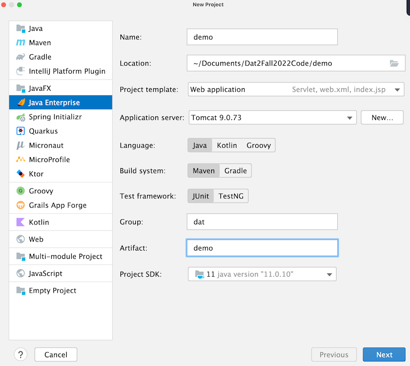
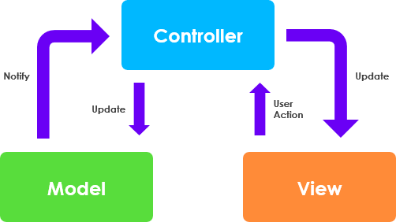

# dokumentation
dette er min egen dokumentation af java webstack
vi skal lave et intranet og vil bruge denne dokumentation til 
bedre at kunne huske hvordan vi har gjort.

## START AF ET NYT WEBPROJEKT:
1. opret nyt projekt i intellij
2. vælg Java EE 8
3. Java + Maven
4. Tomcat Servlet

## Arkitektur

vi anvender en slags MVC pattern.
som er en model view controller, der håndterer requests og responses af data.
som vist her:

- M: Model - modellen er vores entiteter, hjælpemetoder og klasser.
- V: View - JSP og front-end filer
- C: Controller - servlets og andre klasser der håndterer requests og responses

Husk! ingen kommunikation mellem view og model, det skal altid gå igennem controlleren.
